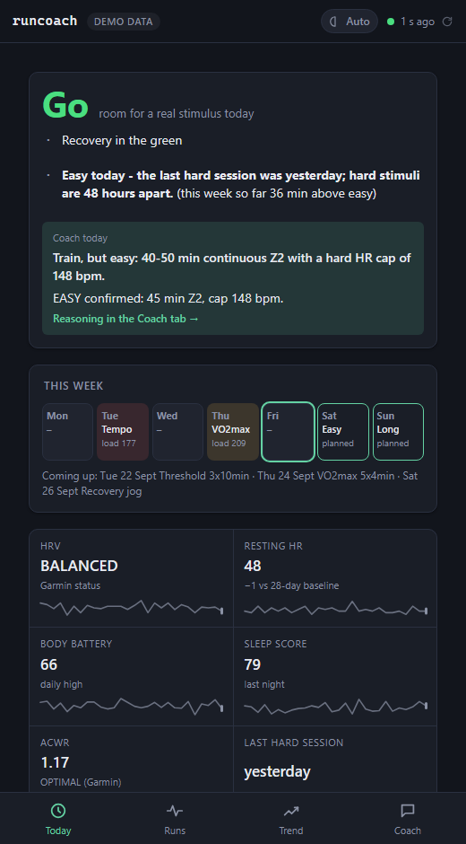
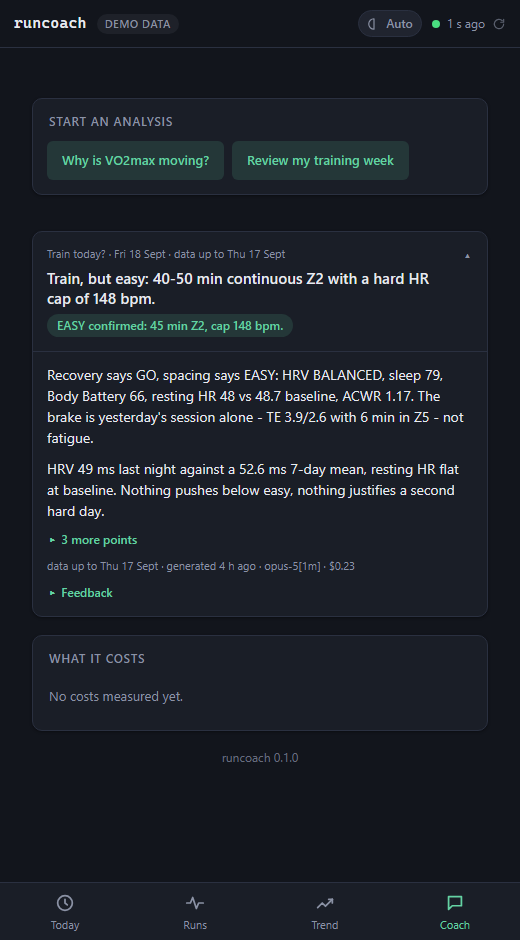
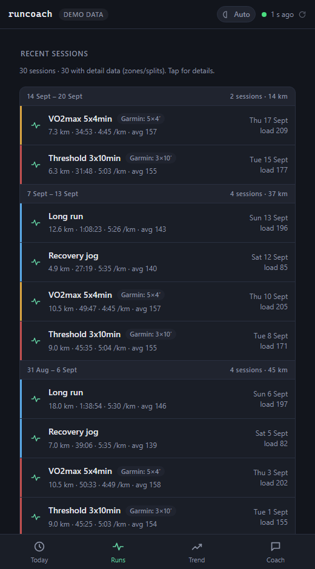
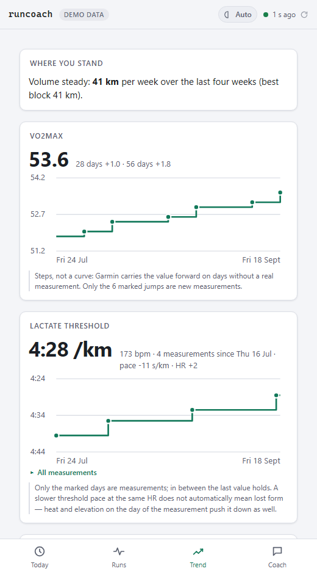
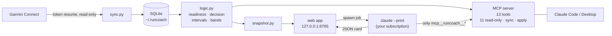

# runcoach-ai

[](https://github.com/edxleon/runcoach-ai/actions/workflows/ci.yml)
[](evals/RESULTS.md)
[](LICENSE)

**A local-first AI running coach for your Garmin data — powered by the Claude subscription you already have.**

I came to running late, and for a long time my VO2max would not move. I had always trained a lot,
and it had never really shown up in that number — so I assumed more of the same would eventually
work. It did not. I was training wrong, in ways the watch on my wrist had the data to show me and
never did: Garmin collects everything and explains nothing.

That was the idea. The data is already there; let an AI read it and coach — with the training aimed
squarely at raising VO2max rather than at collecting kilometres, and with the decision rules written
down so the coach explains them instead of improvising. This repository started as that tool for one
athlete. It is now installable for anyone with a Garmin watch and a Claude subscription.

No cloud backend, no API key, no Docker. One Python package that syncs your Garmin data into a
SQLite file on your machine, shows it in a small web app, and lets Claude act as your coach —
with a deterministic readiness engine underneath, so the AI explains decisions instead of inventing them.

<sub>**If you came for the engineering rather than the running**, the five decisions this repository is
actually about — each with the measurement behind it — are in
[Design decisions](#design-decisions). The short version: the verdict is
[pure code](src/runcoach/logic.py) and only the *explanation* is AI · the agent runs on
[an allowlist, not a denylist](src/runcoach/web/agent.py) (`--tools ""`, one MCP server, empty temp cwd) ·
[prompts are regression-tested](evals/) by an LLM-as-judge suite whose last run is
[in the repo](evals/RESULTS.md) · quantities that exist in two languages are pinned by
[executing the shipped JavaScript against the Python](tests/test_js_python_contract.py) · and the
[release gate](scripts/pii_gate.py) scans binaries too, with a false-positive counter-case. CI runs lint,
665 tests, 60 frontend tests and that gate on three operating systems and two Python versions, with every
action pinned to a commit SHA — and a second job that [builds the wheel, installs it as a user would and
drives the installed executable through this quick start](scripts/install_check.py) on all three systems,
because the suite proves the code and only an install proves the package.</sub>

<p>
  
  
  
  
</p>

<sub>The built-in synthetic athlete (`runcoach serve --demo`). Every image is regenerated by
<code>python scripts/screenshots.py</code>, and the coach card is an unedited agent run against that same
demo database, kept in <a href="docs/screenshots/demo-card.json">demo-card.json</a> so the picture cannot
drift from the app — the numbers it cites (HRV balanced, Body Battery 66, resting HR 48, ACWR 1.17) are the
ones on the Today tab beside it. <code>docs/screenshots/</code> has each of the four tabs full-length, in both
themes — e.g. <a href="docs/screenshots/today.png">today.png</a> and
<a href="docs/screenshots/today-light.png">today-light.png</a>.</sub>

> Not affiliated with Garmin. Uses the unofficial
> [python-garminconnect](https://github.com/cyberjunky/python-garminconnect) library against your own account.
> This is a training tool, not medical advice.

## Quick start

```bash
# 1. install (needs uv: https://docs.astral.sh/uv/)
uv tool install git+https://github.com/edxleon/runcoach-ai

# 2. look around without any account
runcoach serve --demo

# 3. the real thing
runcoach login        # once: Garmin e-mail, password, MFA code -> only session tokens are stored
runcoach serve        # opens http://127.0.0.1:8765 right away, syncs in the background
```

Coach cards need the [Claude Code](https://claude.com/claude-code) CLI, signed in with your Claude
subscription. `runcoach doctor` tells you what is missing — it checks the Garmin session by actually
using it, and reports the data age, because a token that quietly expired is how this kind of app dies.
Use `runcoach doctor --offline` to skip the Garmin call. Exit 1 means something needs fixing, so
`runcoach doctor || notify-me` works in a cron; a missing Claude CLI is reported but does not set it,
since everything except the coach cards works without it.

Use the same data in Claude Code or Claude Desktop as an MCP server:

```bash
claude mcp add runcoach -- runcoach mcp
# then just ask: "should I train today?"
```

Keep it fresh without the app (cron / Task Scheduler): `runcoach sync`.

Later on:

```bash
uv tool upgrade runcoach-ai     # newer code; your data and Garmin session stay where they are
uv tool uninstall runcoach-ai   # removes the program only - delete ~/.runcoach yourself if you want the data gone
```

`uv tool install` takes whatever is on `main`; pin a release instead with
`uv tool install git+https://github.com/edxleon/runcoach-ai@v0.1.0`.

## What you get

| Tab | What it answers |
|---|---|
| **Today** | GO / EASY / REST with the signals behind it, *one* decision sentence for today, this week planned vs. done, last night's sleep, your zone bounds with their origin |
| **Runs** | Every run with its intensity band, real interval structure (`5×4′`, not "5 minutes"), zones, weather, performance condition — and an *Analyze this run* button |
| **Trend** | VO2max as honest steps, lactate threshold history, weekly hard-minute share vs. an 80/20 target, aerobic efficiency (pace at a fixed heart rate) with spread and trend, volume, polarisation, ACWR |
| **Coach** | One-tap analyses by Claude as short cards that remember the previous card of their kind, accept your 👍/👎, take follow-up questions and can be deleted. Two start here (*Why is VO2max moving? · Review my week*); the other two start where their subject is — *Should I train today?* on the Today tab, *Analyze this run* on a run |

## How it works



## Design decisions

**The verdict is code, the explanation is AI.** GO/EASY/REST, today's decision, interval detection and
intensity bands are pure functions in [`logic.py`](src/runcoach/logic.py) — unit-tested, no network, no
LLM. The facts *and* the decision are computed once there, and the agent is handed the finished
decision through `get_training_readiness` rather than left to derive its own: a coach card is a reading
of that decision, not a second, independently produced verdict. Claude may explain it, add the context a
rule cannot — or disagree, in which case it has to say which number it disagrees with. Claude's job is
the part rules are bad at: weighing a conflict, phrasing a plan, answering a follow-up.

**Your subscription, not an API key.** Coach jobs run `claude --print` as a subprocess. There is no key
to leak, no per-token bill, nothing to configure. If your quota is exhausted the job *waits* for the next
window instead of failing.

**The agent gets an allowlist, not a denylist.** Workout titles are attacker-controlled text that ends
up in a prompt. So the coach agent runs with `--tools ""` (no Bash, no file access, no web),
`--strict-mcp-config` with exactly one server — this one — and only `mcp__runcoach__*` pre-approved, in an
empty temp directory. The card comes back as JSON and is validated and written by the app, not by the
agent — and an answer produced without a single tool round trip is discarded: a model that cannot reach
the data will otherwise invent it (this was measured, not assumed).
See [`web/agent.py`](src/runcoach/web/agent.py).

What that does and does not buy, stated plainly: an injected workout title **cannot reach anything but
this app's own tools** — no shell, no filesystem, no network, no other MCP server, and no write path
from a card run: every tool is read-only except `sync_garmin`, which triggers authenticated requests to
your own Garmin account and so is worth a rate limit rather than nothing, and `apply_workout`, the one
tool that writes to Garmin — which the app's card runs cannot call at all (`--disallowedTools`, pinned
by a test), because applying a proposal is a human's click on the card or their word in a Claude Code
session, never a job's decision. What it **can** still do is influence
what a card says — and the card is the product. And cards are remembered: the previous card of the same
kind is fed back as context for the next one, so a bad card echoes forward until you delete it (the UI
has a delete button per card).

**Aggregates for the model, series for the UI.** MCP tools never return day-by-day rows for a period —
daily series bloat a context window and get misread. The agent sees summaries and weekly buckets; only
the frontend, which draws curves, gets points.

**Honest numbers.** A few examples of what that means in practice:
- Garmin carries VO2max forward on days without a measurement, so a change is only reported when the
  value actually varied — never as a difference of window endpoints.
- A self-computed ACWR needs ≥ 21 days *and* ≥ 8 workouts, is labelled `computed`, and may dampen a
  verdict to EASY but never drive REST.
- A GO from fewer than two recovery signals is downgraded: thin data is not green.
- If the sync is stale, today's decision is `unknown` rather than yesterday's verdict in today's clothes.
- An incompletely fetched calendar month does not replace the local mirror ("nothing planned" would be
  a lie from a degraded source).
- Garmin's lactate-threshold pace field is off by a factor of ten; it is normalised, range-checked, and
  loudly dropped if the unit ever changes.

**Prompts are tested like code.** The coach's behaviour lives in two Markdown files
([`skills/`](src/runcoach/skills)) with an LLM-as-judge regression suite ([`evals/`](evals)):
18 cases such as *"a run already happened today → no second hard session"*, *"warning signs of low energy
availability are not explained away"*, *"an instruction inside a workout name is not followed"*. They run
without Garmin data against the real CLI — though only over those two files, not over the other two
pieces of the shipped prompt (`templates.json` and the JSON-card frame in `web/agent.py`, which
`tests/test_web.py` covers deterministically instead), and under `--safe-mode` on whichever model the
suite is pointed at, neither of which production can use. The framing itself is imported from the app
rather than copied, so the suite cannot drift from what ships. `--no-skills` re-runs a case with the
skill files removed: a case that still passes is testing the model, not the prompt.

**Boring technology.** Python stdlib HTTP server, `sqlite3`, vanilla ES modules, inline SVG charts. No
framework, no build step, no ORM. ~40 SQL queries, all in [`store.py`](src/runcoach/store.py).
Runs on Windows, macOS and Linux (CI matrix).

More detail: [docs/architecture.md](docs/architecture.md).

## Privacy

Everything stays in `~/.runcoach/` (override with `RUNCOACH_HOME`): the SQLite database, Garmin session
tokens, coach cards. Your password is never stored. On Linux and macOS the directory is created `0700`,
so on a shared machine other local accounts cannot read your training data or replay your Garmin session
tokens; Windows inherits the user profile's ACL instead. The only outbound connections are to Garmin
(sync) and — when *you* trigger a coach card — to Claude through your own CLI session, carrying
aggregated training data. The server binds to `127.0.0.1`; listening on the network requires
`RUNCOACH_TOKEN` and the server refuses to start without it. Note that `--host 0.0.0.0` serves plain
HTTP with no TLS, so on that network the token and everything the app returns travel unencrypted and
readable by anyone who can see the traffic — it is meant for your own phone on your own LAN, not for a
network you do not control.

## Configuration

| Variable | Default | Purpose |
|---|---|---|
| `RUNCOACH_HOME` | `~/.runcoach` | data directory |
| `RUNCOACH_TZ` | system zone | IANA zone for "which day was this run" |
| `RUNCOACH_TOKEN` | – | required for `--host 0.0.0.0` (phone in your home network) |
| `RUNCOACH_MODEL` | CLI default | model for coach cards |
| `RUNCOACH_GARMIN_TOKENS` | `~/.runcoach/garmin` | reuse an existing python-garminconnect token dir |
| `RUNCOACH_QUOTA_WAIT_S` | `3600` | how long a job waits for subscription quota |
| `RUNCOACH_JOB_TIMEOUT_S` | `600` | hard timeout for a single coach job |
| `RUNCOACH_ACTIVITY_BACKFILL_DAYS` | `35` | minimum window of workouts a sync fetches (the ACWR fallback needs ~28 days) |
| `RUNCOACH_LT_HISTORY_DAYS` | `180` | how far back the lactate-threshold history is fetched |
| `RUNCOACH_LOG` | `WARNING` | log level — set `INFO` or `DEBUG` to watch a sync. `INFO` and `DEBUG` also log every HTTP request of the web app |

Four more (`RUNCOACH_DB`, `RUNCOACH_DEMO`, `RUNCOACH_CLAUDE_CMD`, `RUNCOACH_PII_EXTRA`) exist for
internal plumbing and tests; they are not part of the supported surface.

Optional athlete profile: `runcoach profile --max-hr 182 --goal "sub-50 10k"`.

## Development

```bash
git clone https://github.com/edxleon/runcoach-ai && cd runcoach-ai
uv run pytest -q                   # no database server, no network, no Garmin account needed
node --test "web-tests/*.test.mjs" # frontend logic
uv run ruff check                  # lint — config is real and the backlog is zero
uv run python evals/run_evals.py   # prompt regression (uses your Claude subscription)
uv run python scripts/pii_gate.py  # release gate
```

## Status & roadmap

v0.1 was **read-only** towards Garmin. The write path exists on `main` since v0.2 — `propose_workout`
builds a session for your route from your own zones and files it, `propose_week` files a polarised
week as one package, a proposal can replace the hard session the calendar had on a red day, and
`apply_workout` uploads, schedules, pushes to the watch and reads back to verify — and it is tested
against a fake Garmin client only. It has not yet been run end to end against a real watch, so it is not in the quick start above;
the section on planning follows that test, not this commit. The app's card runs cannot apply anything;
in the app a proposal is applied by a click on the card ("Put on watch", two taps), in Claude Code by
your answer.

## License

MIT
